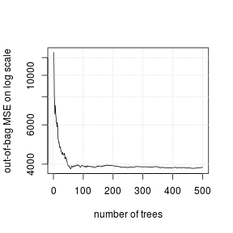
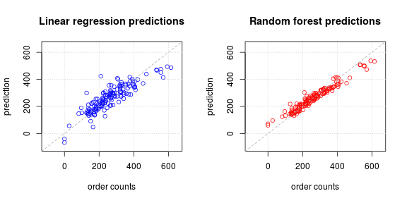

Goal
=================================================
We are given observations of numbers of restaurant orders 
for different dates, as well as the number of restaurants that were
open on the given dates and the ambient weather conditions including
minimum and maximum temperature, the amount of percipitation and weather events
such as fog, rain or snow.
The objective is to build a predictive model of restaurant orders.


Exploratory Analysis
=================================================
One looks for missing values. We observe that there are none.


```r
zmr.train <- read.csv (file = "Zoomer_take_home_challenge_training_set.csv", header=TRUE)
sum (is.na (zmr.train))
```

```
## [1] 0
```

One also examines the skewness of the response variable; we observe that it is
 just over 0.7, indicating only moderate skewness. Therefore, there is no need for a Box-Cox transformation.
 

```r
skewness (zmr.train$order_count)
```

```
## [1] 0.701062443806
```

One looks for and removes any covariates with near zero variance.
We observe that the given data set has no near zero variance predictors.


```r
nearZeroVar (zmr.train[,-3])
```

```
## integer(0)
```

Examining the prevalence of the levels of the factor variable
`events`, we see that some levels have only a few entries, indicating that
these levels are overly finely divided. 


```r
table (zmr.train$events)
```

```
## 
##               Fog          Fog-Rain     Fog-Rain-Snow          Fog-Snow 
##                 1                 5                 1                 3 
##              None              Rain         Rain-Snow Rain-Thunderstorm 
##                89                31                 6                 2 
##              Snow 
##                14
```
Consequently, we replace the `event` column with three
binary factors:

- `Fog` whether or not there was fog

- `Rain` whether or not there was rain 

- `Snow` whether or not there was snow

Clearly the absent level `None` corresponds to the above three being `FALSE`. 

Additionally, we make `calendar_code` a factor variable. These transformations are implemented by the function `mytrns` given below:


```r
mytrns <- function (indf) {
 outdf <- data.frame (weekday =as.factor (weekdays (as.Date (indf$X, '%Y-%m-%d'))))
 outdf$calendar_code <- as.factor (indf$calendar_code)
 outdf$restaurant_count <- as.numeric (indf$restaurant_count)
 
 outdf$max_temp <- indf$max_temp
 outdf$min_temp <- indf$min_temp
 outdf$precipitation <- indf$precipitation
 
 tmp <- grep ("Fog", indf$events)
 v <- vector ("logical", dim(indf)[1])
 v[tmp] <- TRUE; v[-tmp] <- FALSE
 outdf$Fog <- as.factor (v)
 
 tmp <- grep ("Rain", indf$events)
 v[tmp] <- TRUE; v[-tmp] <- FALSE
 outdf$Rain <- as.factor (v)
 
 tmp <- grep ("Snow", indf$events)
 v[tmp] <- TRUE; v[-tmp] <- FALSE
 outdf$Snow <- as.factor (v)
 
  outdf
}

trans.zmr.train <- mytrns (zmr.train)  # Transformed covariates
y <- zmr.train$order_count  # The response variable
```


Model fitting
=========================================
After applying the above transformation, we experiment with two different models.
First we fit a linear regression model, and observe that the apparent RMSE error
is `53.2`.


```r
fitlm <- lm (y~0+., data=trans.zmr.train)
prdlm <- predict (fitlm, newdata=trans.zmr.train)

RMSE <- function (x, y) {
  stopifnot (length(x) == length(y))
  s <- sqrt (mean ((x-y)^2))
  s
}

cat ("Linear model apparent error = ", RMSE (prdlm, y), '\n')
```

```
## Linear model apparent error =  53.2364122578
```

Next we fit a random forest to the transformed data, and observe that the greatest
reduction in out-of-bag MSE estimate is achieved by the first 200 trees; so we 
refit the forest with `ntree=200`.


```r
rffit <- randomForest (y~., data=trans.zmr.train, importance=TRUE)
plot (rffit$mse, type='l', xlab="number of trees",
      ylab = "out-of-bag MSE on log scale", log="y"); grid()
```

 

```r
rffit <- randomForest (y~., data=trans.zmr.train, importance=TRUE, ntree=200)
rfprd <- predict (rffit, newdata=trans.zmr.train)
cat ("Re-fitted random forest apparent error = ", RMSE (rfprd, y), '\n')
```

```
## Re-fitted random forest apparent error =  30.4371753463
```

As expected the random forest model has superior apparent error performance `30.4`.
We can visualize the relative performance of the two models
 by plotting their respective predictions versus the response on the training set
itself.

 

The transformed covariates are listed in decreasing order of their importance (to the random forest model) below.
We see that the weather events are not very important, and that the day of the week is less significant
than the air temperature.


```r
sgnf <- importance (rffit, scale=TRUE)
ind <- order (sgnf[,2], decreasing = TRUE)
print (sgnf[ind,])
```

```
##                         %IncMSE  IncNodePurity
## restaurant_count 21.13520195485 638435.1346146
## max_temp         12.13167046363 380916.2306626
## min_temp          8.09130116711 255780.1077987
## weekday           7.87850957900 158355.5490702
## calendar_code    15.70911272566 133344.3504638
## precipitation     1.56285557309  67388.0483171
## Snow              2.51157532822  47198.1856889
## Rain              1.90060738895  22714.9276793
## Fog              -3.64867866959  10437.8487651
```


Prediction
=====================================================

We transform the test data as above (using `mytrns`) before applying the prediction. The predicted values are written in a file called `end_product.csv`.


```r
zmr.test <- read.csv ("Zoomer_take_home_challenge_test_set.csv", header=TRUE)
trans.zmr.test <- mytrns (zmr.test)
# The following line is necessary since the test set has only calendar_code==1.
levels (trans.zmr.test$calendar_code) <- levels (trans.zmr.train$calendar_code)

prd <- predict (rffit, newdata=trans.zmr.test)
write (round(prd), file="end_product.csv", sep='\n')
```


Additional questions
=======

Information about whether a given day is a holiday or a long weekend might help improve the prediction.

Saturdays appear to have the largest number of orders averaging 313, while Thursdays appear to have the fewest averaging 220. The mean numbers of orders per day of the week and the associated t-confidence bands are calculated using the following code fragment.


```r
days <- levels (trans.zmr.train$weekday)
m <- list()
for (d in days) {
  ind <- which (trans.zmr.train$weekday == d)
  bydaydat <- zmr.train[ind,]
  m[[d]] <- mean (bydaydat$order_count)
  s <- sd (bydaydat$order_count)
  n <- length(ind)
  ci <- m[[d]] + s * qt(p=0.95, df=n-1) * c(-1,1)/sqrt(n)
  str <- sprintf ("mean for %s = %f, tCI=[%f, %f]\n", d, m[[d]], ci[1], ci[2])
  cat (str)
}
```

```
## mean for Friday = 300.857143, tCI=[250.622679, 351.091607]
## mean for Monday = 234.434783, tCI=[205.231987, 263.637578]
## mean for Saturday = 313.090909, tCI=[271.714332, 354.467486]
## mean for Sunday = 295.818182, tCI=[249.442259, 342.194105]
## mean for Thursday = 219.571429, tCI=[181.675709, 257.467148]
## mean for Tuesday = 230.045455, tCI=[198.571965, 261.518944]
## mean for Wednesday = 248.047619, tCI=[209.466787, 286.628451]
```

```r
d <-which.max (m)
cat ("Most average orders ", m[[d]], " on ", days[d], '\n')
```

```
## Most average orders  313.090909091  on  Saturday
```

```r
d <- which.min (m)
cat ("Fewest orders ", m[[d]], " on ", days[d], '\n')
```

```
## Fewest orders  219.571428571  on  Thursday
```


